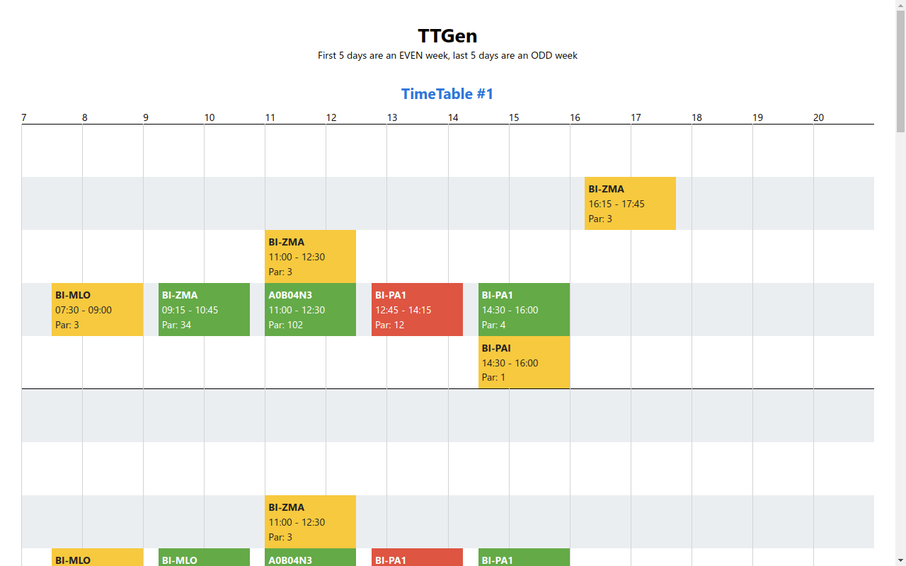
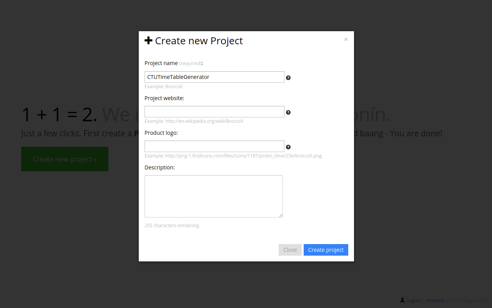
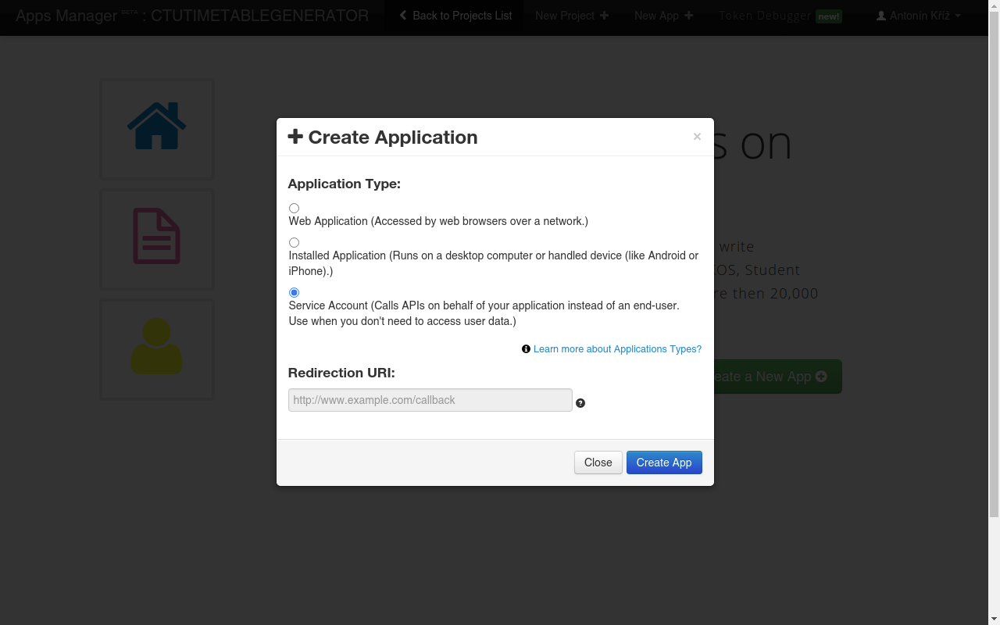
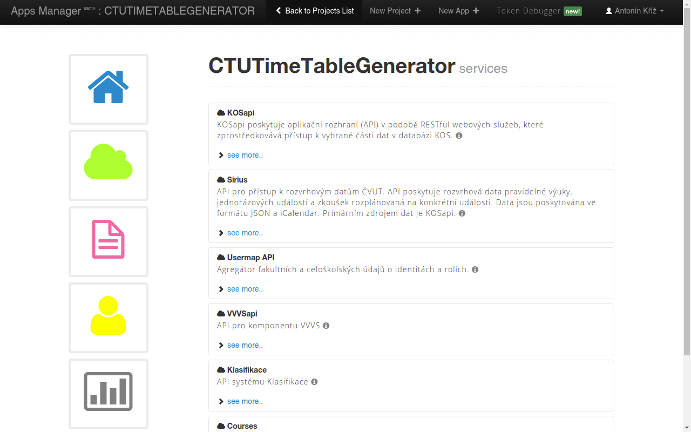
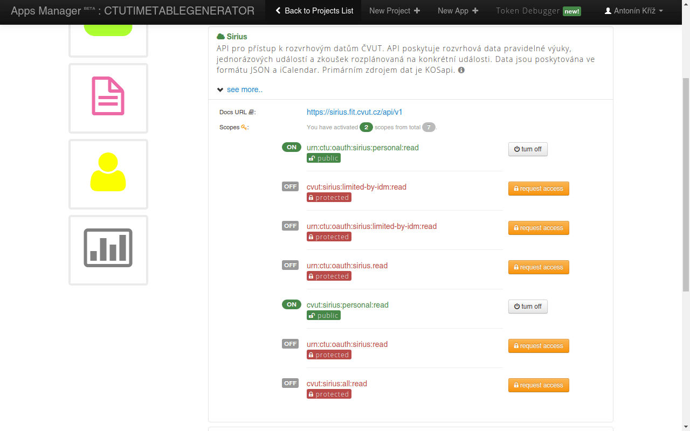
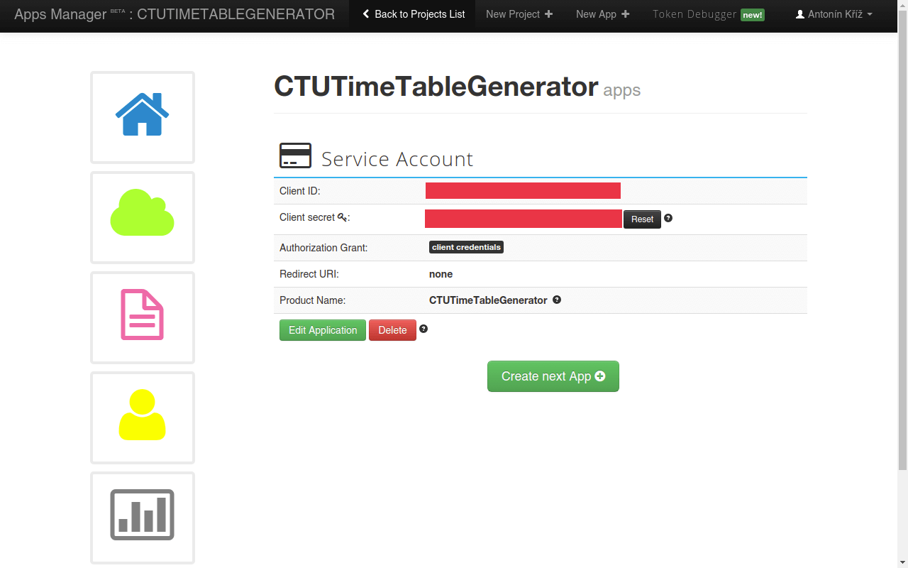

> *This project has been replaced by newer, faster and much more user friendly [CTU-TimeTable-Generator](https://github.com/antoninkriz/CTU-TimeTable-Generator)*

---



# CTU-TimeTableGenerator-new

New Time Tables Generator for CTU (CVUT).

## How to use

### Requirements

* [Git](https://git-scm.com/) (`sudo apt-get install git`) - tested on version 2.41
* [Boost Lib](https://www.boost.org/) (`sudo apt-get install libboost-all-dev`) - tested on version 1.81
* [GCC](https://gcc.gnu.org/) (`sudo apt-get install gcc g++`) - tested on version 13.2.1
* [CMake](https://cmake.org/) (how to install on Ubuntu [here](https://askubuntu.com/questions/829310/how-to-upgrade-cmake-in-ubuntu)) - tested on version 3.27.1
* [Python 3](https://www.python.org/) (how to install on Ubuntu [here](https://linuxize.com/post/how-to-install-python-3-8-on-ubuntu-18-04/)) - tested on version 3.11.3
* [Node.js 18](https://nodejs.org/) (how to install on Ubuntu [here](https://linuxize.com/post/how-to-install-node-js-on-ubuntu-20-04/#installing-nodejs-and-npm-from-nodesource)) - tested on version 18.16.0
* [Yarn](https://yarnpkg.com/) (how to install on Ubutu [here](https://classic.yarnpkg.com/en/docs/install/#debian-stable)) - tested on version 1.22.19

### Get Siriuis Time Table API credentials

Generate [Sirius](https://github.com/cvut/sirius) API credentials [here](https://auth.fit.cvut.cz/manager/).

#### Steps

**1** 


**2**


**3**


**4**


**5**


### Edit config.txt

Example configuration

```conf
CLIENT_ID=Your client id
CLIENT_SECRET=Your client secret

FACULTY=ID of a faculty (18000 for FIT)
SEMESTER=ID of a semester (B201 for 2020/21)

COURSES=Space separated list of courses (e.g. BI-AAG A0B04N3 BI-AG1 BI-ZDM A0B04GA)
IGNORE_LECT=Space separated list of courses with ignored lectures (e.g. BI-AAG BI-AG1)
IGNORE_TUTS=Space separated list of courses with ignored tutorials
IGNORE_LABS=Space separated list of courses with ignored laboratories

NE_730=Should time tables with classes before or at 7:30 AM  be punished? (e.g. true)
NE_915=Should time tables with classes before or at 9:15 AM  be punished? (e.g. false)

BUILD=Build folder location (e.g. _build)
PORT=Port which will be used for the HTTP server to serve the generated content
```

### Build and run the app

**Build and run**  
This must be your first step

```bash
./run.sh
```

**Build or rebuild only**  
Useful for development

```bash
./_build.sh
```

**Run only**  
This can be useful when the app is already built but the `config.txt` has changed

```bash
./_start.sh
```
